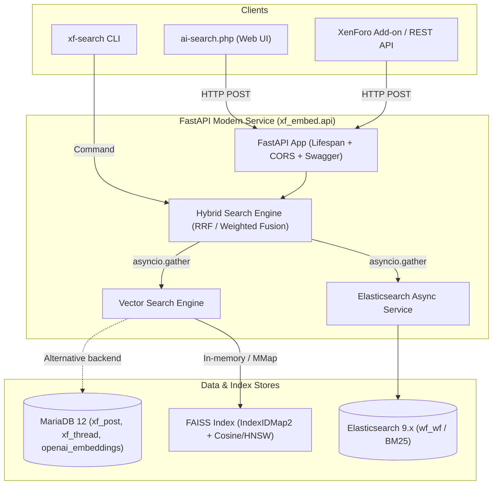

# OpenAI Embeddings & Hybrid Search for XenForo (with FAISS & Elasticsearch)

Modern, high-performance semantic and hybrid search solution for XenForo forums. Combines **OpenAI embeddings** (`text-embedding-3-small`), **FAISS** vector similarity search (with `IndexIDMap2` and HNSW/Cosine support), and **Elasticsearch** (BM25 keyword search) using **Reciprocal Rank Fusion (RRF)**.

[](https://opensource.org/licenses/MIT)
[](https://www.python.org/)

---

## Key Features & Modernizations

- **True Hybrid Search (RRF)**: Merges semantic vector hits with Elasticsearch BM25 keywords via Reciprocal Rank Fusion ($k=60$) or weighted score fusion, replacing legacy sort-by-date logic.
- **High-Throughput FAISS Indexing**: Uses `IndexIDMap2` with unit-normalized Inner Product (exact cosine similarity). Streams millions of rows from MySQL in batches without exhausting memory.
- **FastAPI Modern Async Service**: Fully async backend powered by `aiomysql`, `AsyncElasticsearch`, and `AsyncOpenAI`. Includes automatic OpenAPI Swagger documentation (`/docs`) and `/health` monitoring.
- **High-Speed Elasticsearch Bulk Indexing**: Ingests hundreds of thousands of documents via `elasticsearch.helpers.async_bulk` (50–100x faster than legacy single-document calls).
- **MariaDB 12 Vector Search Backend**: Optional zero-RAM alternative using MariaDB 12 native `VEC_DISTANCE_COSINE()` queries.
- **Interactive CLI (`xf-search`)**: Built with Typer and Rich for easy server management, index generation, terminal search queries, and latency benchmarking.
- **Automated Test Suite**: Full `pytest` unit and integration test coverage.

---

## Architecture Overview



---

## Requirements

- **Python**: 3.10+ (tested on Python 3.10 – 3.14)
- **Database**: MySQL 8.0+ or MariaDB 11.7+ / 12.x
- **Search Engine**: Elasticsearch 7.x, 8.x, or 9.x (XenForo Enhanced Search compatible)
- **OpenAI Account**: API key with access to `text-embedding-3-small` (or `text-embedding-3-large`)

---

## Installation

1. **Clone the repository**:
   ```bash
   git clone https://github.com/your-repo/xf-openai-embed.git
   cd xf-openai-embed
   ```

2. **Install dependencies**:
   ```bash
   pip install -r requirements.txt
   # Or install editable CLI tool:
   pip install -e .
   ```

3. **Configure environment variables**:
   Create a `.env` file in the root directory (or use `/web/.env`):
   ```env
   # Database
   MYSQL_HOST=127.0.0.1
   MYSQL_PORT=3306
   MYSQL_USER=your_mysql_user
   MYSQL_PASSWORD=your_mysql_password
   MYSQL_DATABASE=your_xenforo_database

   # Elasticsearch
   ELASTICSEARCH_HOST=http://localhost:9200
   ELASTICSEARCH_USER=
   ELASTICSEARCH_PASSWORD=
   ELASTICSEARCH_INDEX=wf_wf

   # OpenAI
   OPENAI_API_KEY=sk-...
   OPENAI_EMBEDDING_MODEL=text-embedding-3-small
   OPENAI_DIMENSIONS=1536

   # Vector Search Backend ('faiss' or 'mariadb')
   VECTOR_BACKEND=faiss
   FAISS_INDEX_PATH=faiss_index.bin
   FAISS_INDEX_TYPE=flat
   FAISS_METRIC=cosine
   ```

---

## Quick Start & CLI Usage

The `xf-search` command-line tool provides full control:

### 1. Build the FAISS Vector Index
Streams vectors from MySQL in batches and saves the index to disk:
```bash
xf-search index-faiss --batch-size 10000
```

### 2. Start the API Server
Starts FastAPI with Uvicorn:
```bash
xf-search serve --port 8000
# Or using standard Uvicorn:
uvicorn faiss_router:app --host 0.0.0.0 --port 8000 --reload
```
- Interactive API Documentation (Swagger UI): `http://localhost:8000/docs`
- Health Check: `http://localhost:8000/health`

### 3. Test Search from Terminal
```bash
# True Hybrid Search (RRF)
xf-search search "windows 11 installation issue" --mode hybrid --limit 5

# Keyword BM25 Only
xf-search search "blue screen error" --mode elastic --limit 5

# Semantic Vector Only
xf-search search "slow boot times after update" --mode vector --limit 5
```

### 4. Benchmark Search Latency
```bash
xf-search benchmark --query "memory leak" --iterations 15
```

---

## API Endpoints

### 1. Hybrid Search (RRF)
`POST /faiss/combined/`
```json
{
  "query": "how to reset network settings",
  "max_results": 10
}
```
**Response:**
```json
{
  "combined_results": [
    {
      "type": "post",
      "post_id": 841203,
      "thread_id": 321900,
      "thread_title": "Network Reset Instructions",
      "message": "To reset your TCP/IP stack...",
      "post_date": 1720000000,
      "score": 0.0325,
      "ranks": { "vector": 1, "elastic": 2 }
    }
  ],
  "count": 1,
  "query": "how to reset network settings",
  "algorithm": "rrf"
}
```

### 2. Semantic Vector Search
`POST /faiss/search/`
```json
{
  "query": "audio crackling windows 11",
  "max_results": 10
}
```

### 3. Keyword BM25 Search
`POST /faiss/elastic/`
```json
{
  "query": "error 0x80070005",
  "max_results": 10
}
```

---

## Standalone Scripts (Backward-Compatible)

Existing cron jobs and external scripts continue to function:
- `python embed_generate_xf_post.py`: Generates missing post embeddings in batches.
- `python embed_generate_xf_thread.py`: Generates missing thread title embeddings.
- `python embed-elastic.py --overwrite`: Bulk indexes embeddings into Elasticsearch.
- `python embed-vector-search.py '<query>'`: Quick CLI search via MariaDB native vector distance.
- `python embed-faiss-search.py '<query>'`: Standalone FAISS vector query.
- `python embed-faiss-search-with-embed.py '<query>'`: Standalone RRF hybrid search.

---

## Web Interface (`ai-search.php`)

An interactive PHP frontend is included at `ai-search.php`. It supports:
- Switching between **Hybrid (RRF)**, **Semantic Vector**, and **Keyword (BM25)** modes.
- Light and dark themes with persistent preference storage.
- Real-time score badges and metadata display.
- Side-by-side formatted search results and raw JSON inspect panel.

---

## Running Automated Tests

```bash
pytest -v tests/
```

---

## License

MIT License - see the [LICENSE](LICENSE) file for details.

© 2024–2026 Mike Fara, Fara Technologies LLC
